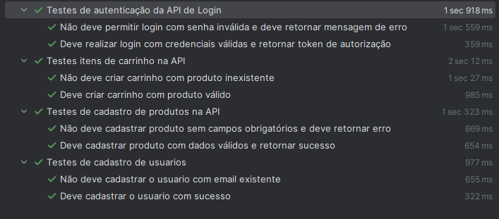

# 🚀 Automação de API – Serverest


Este repositório contém a automação de testes para a API pública [Serverest.dev](https://serverest.dev), desenvolvida em **Java**, com **Maven** e **Rest Assured**.  
O objetivo é validar os principais endpoints e garantir a integridade das funcionalidades críticas de um e-commerce.

---

## 🧩 Funcionalidades e Cenários de Teste

### 🔐 Login
- Login com credenciais válidas.
- Login com email inválido.
- Login com senha incorreta.
- Login com campos obrigatórios vazios.
- Login com formato de email inválido.

### 👤 Usuários
- Cadastro de usuário com dados válidos.
- Cadastro de usuário com email já existente.
- Cadastro com campos obrigatórios vazios.
- Consulta de todos os usuários.
- Atualização de usuário.
- Exclusão de usuário.

### 📦 Produtos
- Cadastro de produto com dados válidos.
- Cadastro de produto com campos obrigatórios vazios.
- Consulta de todos os produtos.
- Atualização de produto existente.
- Exclusão de produto.

### 🛒 Carrinho de Compras
- Criação de carrinho com produtos válidos.
- Criação de carrinho com produtos inexistentes.
- Consulta de carrinho.
- Finalização da compra.
- Cancelamento do carrinho.

---

## 🤖 Cenários Automatizados

| Funcionalidade | Cenário Automatizado | Descrição |
|----------------|----------------------|------------|
| **Usuários** | Cadastro com sucesso | Criação de novo usuário com dados válidos |
| **Usuários** | Cadastro com e-mail duplicado | Valida mensagem de erro ao tentar cadastrar e-mail já existente |
| **Login** | Autenticação válida e inválida | Verifica login com sucesso e falha por credenciais erradas |
| **Produtos** | Cadastro de produto | Valida criação de produto com dados válidos e inválidos |
| **Carrinho** | Adição de produtos e validação de estoque | Verifica se o sistema bloqueia produtos fora de estoque |

---

## ⚙️ Estrutura do Projeto

```
desafio-api-QA
│
├── src
│   ├── test
│   │   ├── java
│   │   │   ├── tests
│   │   │   ├── data
│   │   │   └── utils
│       └── resources
│   
│
├── pom.xml
└── README.md
```

---

## ▶️ Como Executar os Testes

1. **Clone o repositório**
   ```bash
   git clone <url-do-repositorio>
   ```
2. **Acesse a pasta do projeto**
   ```bash
   cd desafio-api-QA
   ```
3. **Execute os testes**
    - **Windows:**
      ```bash
      .\mvnw.cmd test
      ```
    - **Linux/Mac:**
      ```bash
      ./mvnw test
      ```


---

## 🧠 Tecnologias Utilizadas

- [Java 17+](https://www.oracle.com/java/)
- [Maven](https://maven.apache.org/)
- [Rest Assured](https://rest-assured.io/)
- [JUnit 5](https://junit.org/junit5/)

---

## 🎥 Evidência de Execução

Abaixo uma demonstração da execução automatizada dos testes da API:




## 👨‍💻 Autor

**Guilherme Albuquerque Rodrigues**  
💼 QA Engineer SR | Test Automation | API & Mobile & Web
📧 gui.arodrigues@hotmail.com  
🌐 [LinkedIn](https://www.linkedin.com/in/guilherme-albuquerque-b9191b16b/)

---

